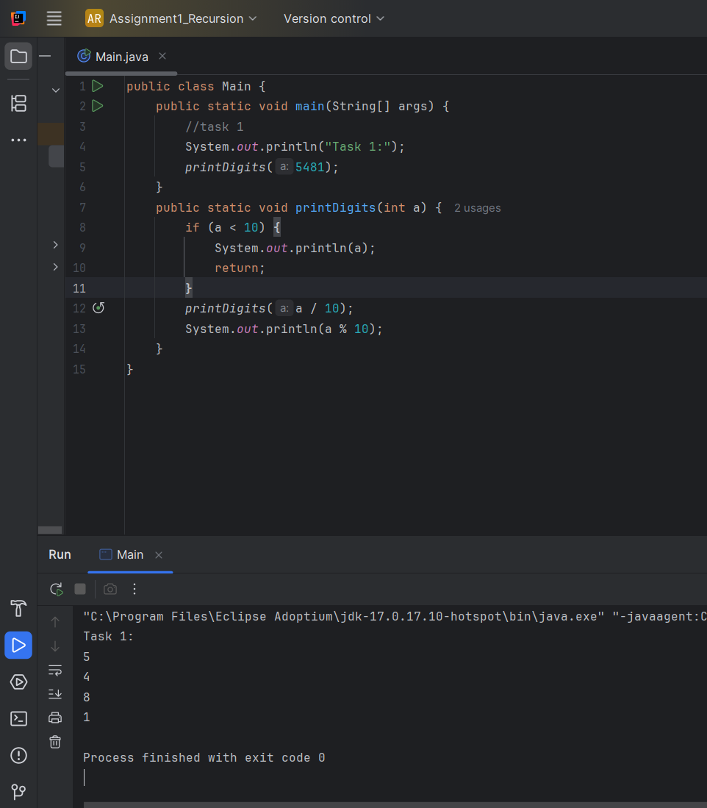
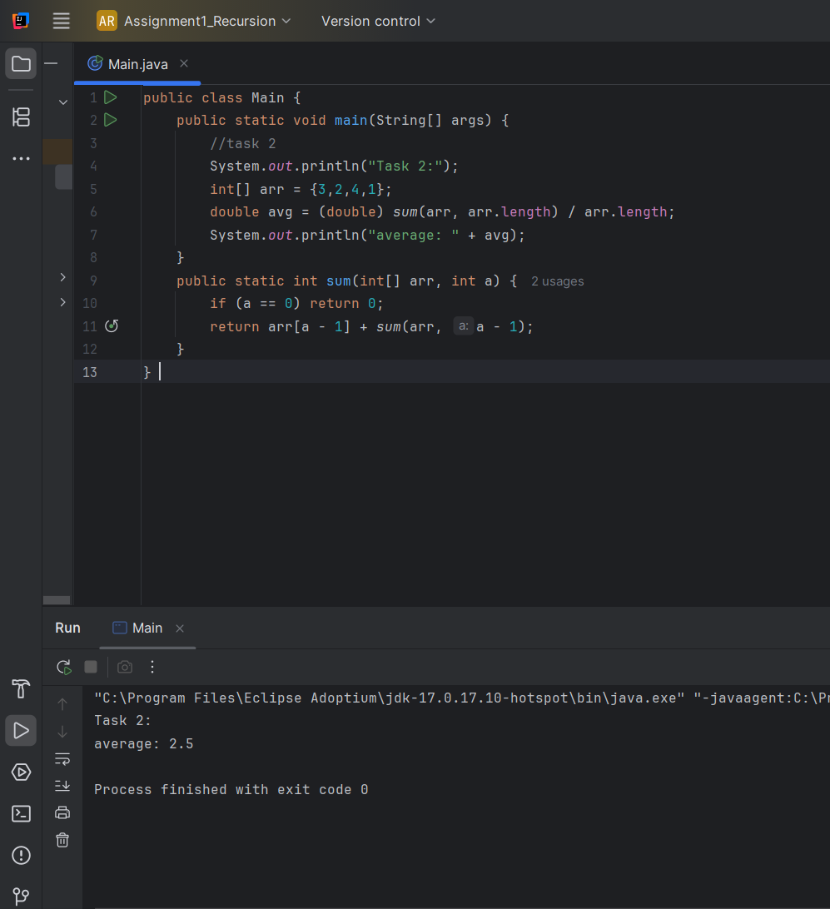
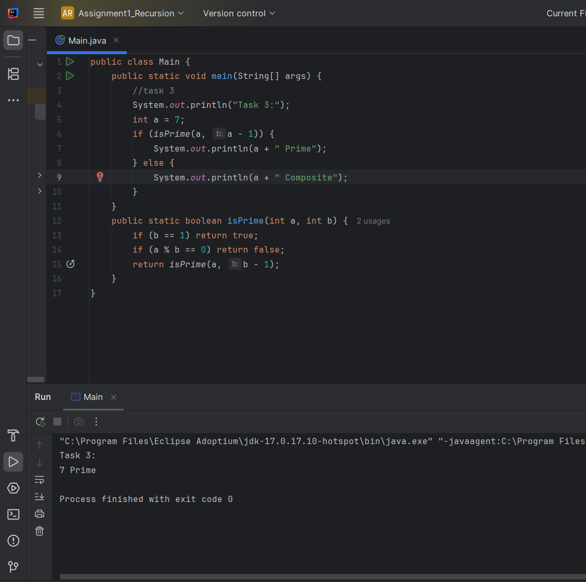
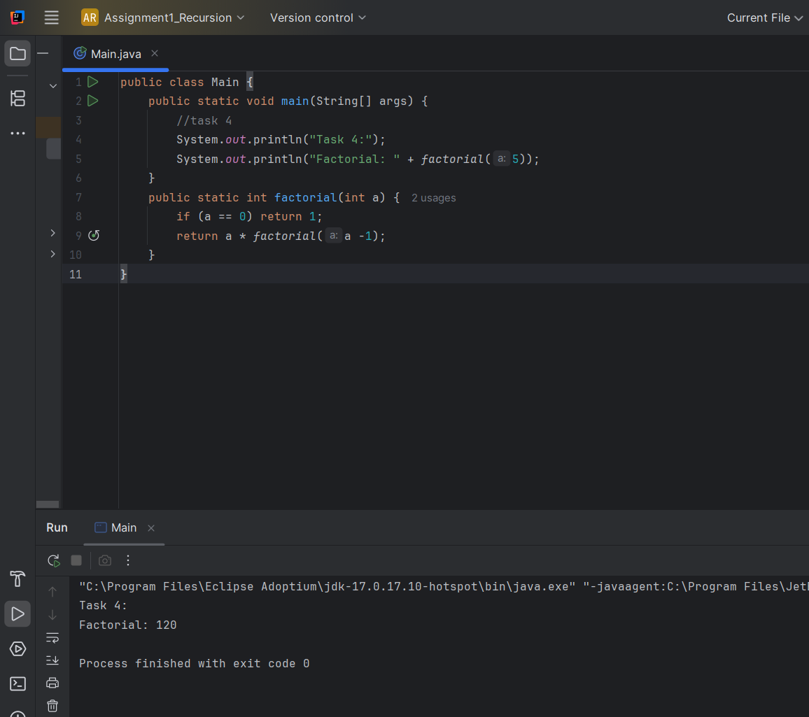
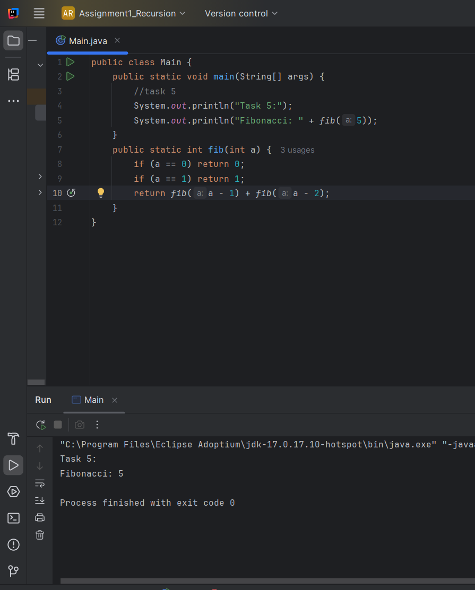
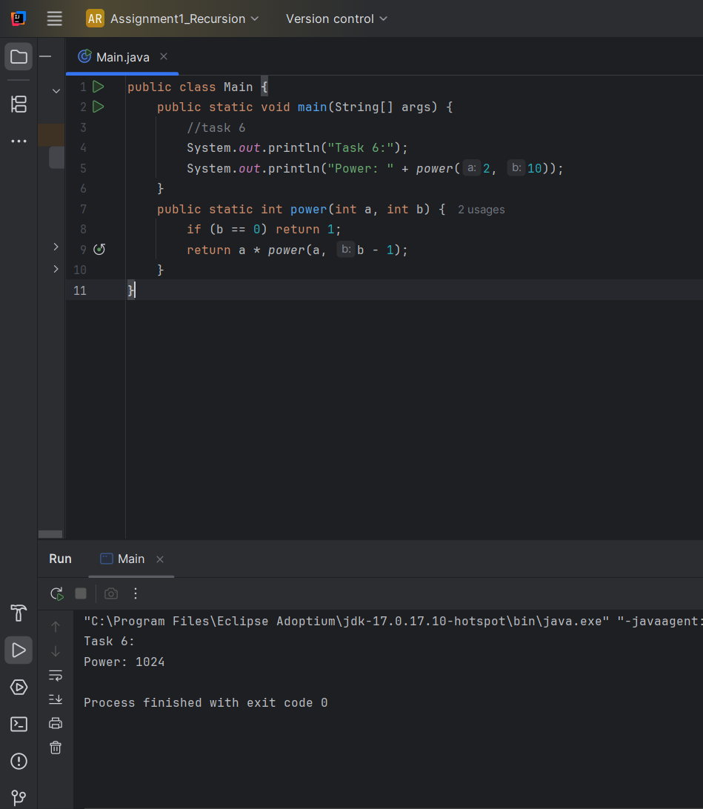
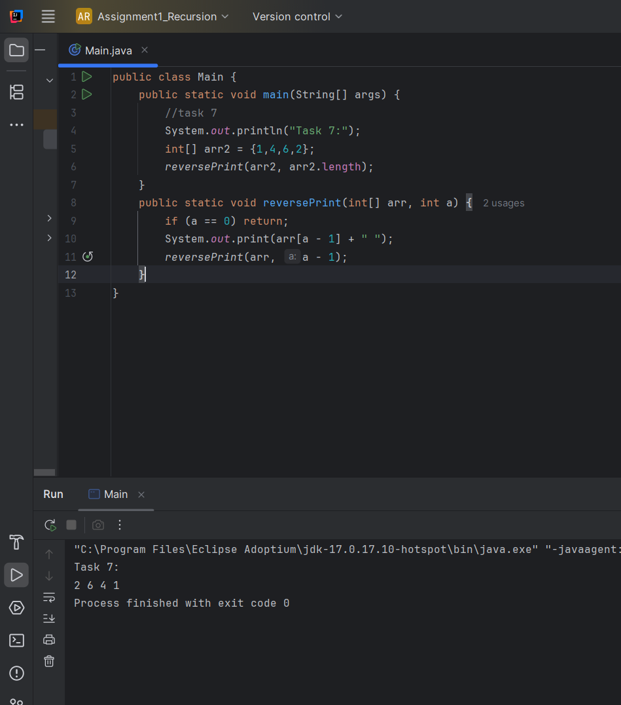
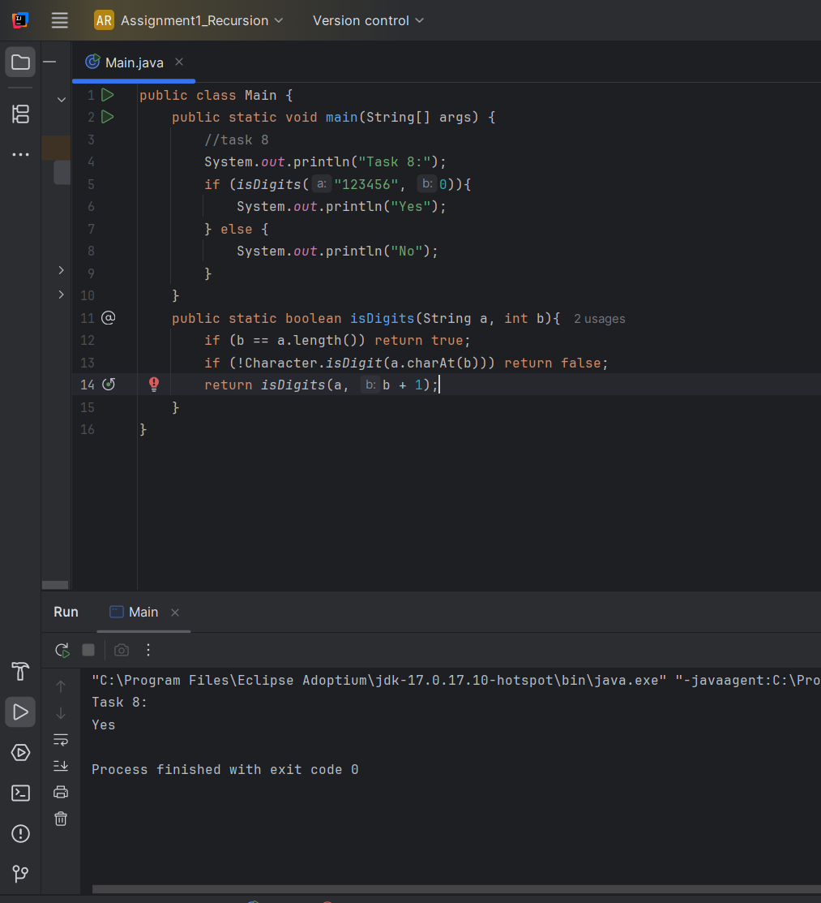
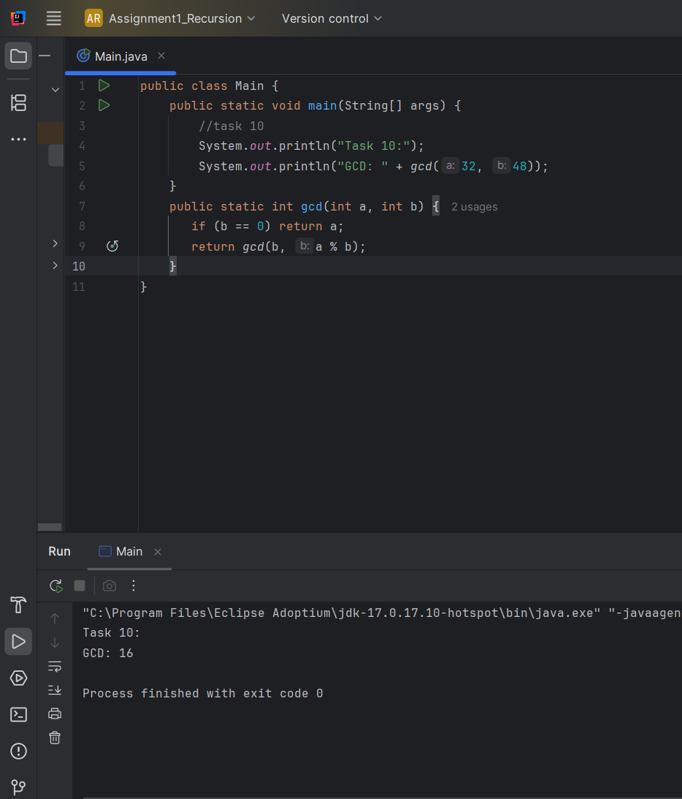

# Assignment 1 – Recursion

## Student Information

Name: Muratova Albina
Group: SE-2511

---

## Objective

The goal of this assignment was to understand how recursion works and learn how to use it to solve different types of problems in Java.

---

## Tasks

In this assignment, I completed the following tasks:

1. Printed digits of a number
2. Found the average of the elements
3. Checked if a number is prime
4. Calculated factorial
5. Found Fibonacci numbers
6. Implemented power function
7. Printed the array in reverse order
8. Checked if a string contains only digits
9. Counted characters in a string
10. Found the GCD using the Euclidean algorithm

---

## Explanation of Tasks

Task 1: Print Digits

This function prints each digit of a number using recursion.
It divides the number by 10 until only one digit remains, and then prints the digits one by one.

---

Task 2: Average of Elements

First, I used recursion to calculate the sum of all elements in the array.
Then I divided the sum by the number of elements to get the average.

---

Task 3: Prime Number Check

This function checks if a number is prime by dividing it by smaller numbers recursively.
If the number is divisible by any number (except 1), it is not prime.

---

Task 4: Factorial

The factorial function multiplies a number by all smaller numbers down to 1.
It uses recursion by calling itself with n-1 until it reaches 0 (base case).

---

Task 5: Fibonacci Number

This function calculates Fibonacci numbers using recursion.
Each number is the sum of the two previous numbers, and the base cases are 0 and 1.

---

Task 6: Power Function

This function calculates aⁿ by recursively multiplying the number a.
It reduces the power step by step until it reaches 0.

---

Task 7: Reverse Output

This function prints elements of an array in reverse order.
It starts from the last element and moves backward using recursion.

---

Task 8: Check Digits in String

This function checks if all characters in a string are digits.
It goes through the string one by one and stops if it finds a non-digit.

---

Task 9: Count Characters in a String

This function counts characters by removing one character at a time.
It continues until the string becomes empty (base case).

---

Task 10: GCD

This function finds the greatest common divisor using the Euclidean algorithm.
It recursively replaces the numbers until the second number becomes 0.

---

## Screenshots

### Task 1

### Task 2

### Task 3

### Task 4

### Task 5

### Task 6

### Task 7

### Task 8

### Task 9

### Task 10

---

## Conclusion

This assignment helped me better understand recursion and improve my problem-solving skills.
Now I feel more confident using recursion in Java.
